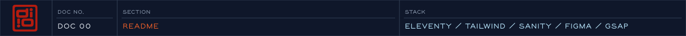
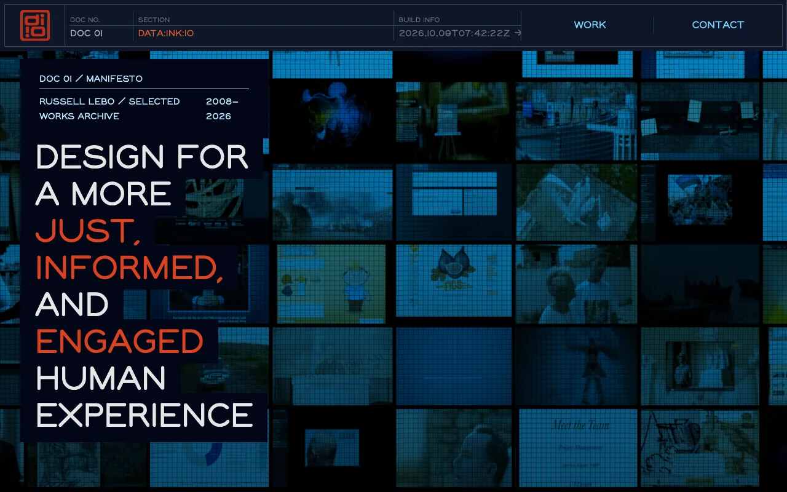
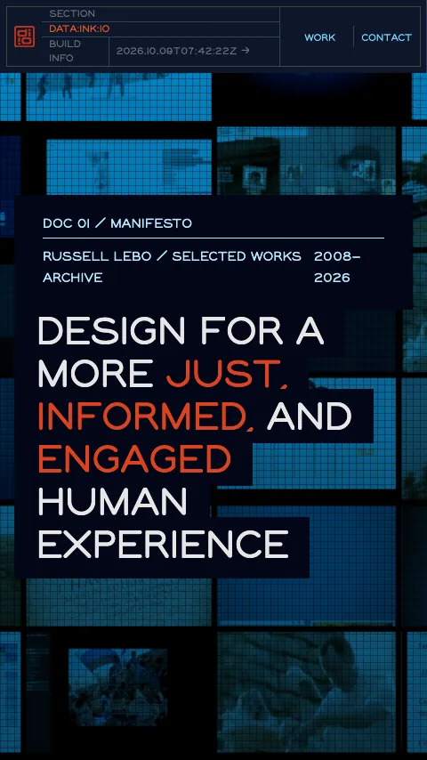
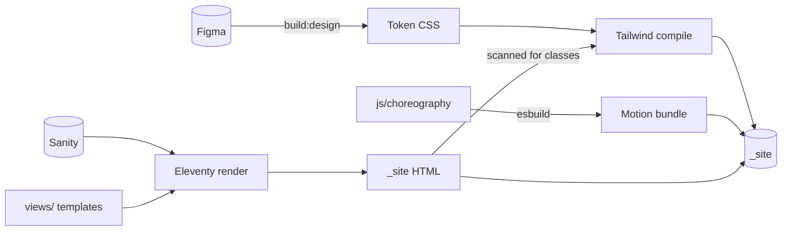

# dataink.io

[](package.json)
[](package.json)
[](package.json)
[](styles/colors.css)
[](package.json)
[](package.json)

I'm Russ Lebo, an experience designer and creative technologist. This is the source for my portfolio, [dataink.io](https://dataink.io).

I designed and built it as a static site. The design system comes from Figma, the content from Sanity, and a GSAP motion layer sits on top using explicit event contracts. I treat the motion as optional: the page works without it.

<p>
  
  
</p>

## Stack, and why

Each tool earned its place:

| Layer     | Tool                                        | Why                                                                                                                         |
| --------- | ------------------------------------------- | --------------------------------------------------------------------------------------------------------------------------- |
| Generator | Eleventy 3                                  | The content is static and the only runtime is motion. Shipping plain HTML means the page works before any JavaScript loads. |
| Templates | Nunjucks, organised by atomic design        | Atoms, molecules, organisms, templates and pages, with one component contract shared by all of them.                        |
| Styling   | Tailwind CSS v4                             | Utilities read design tokens as CSS custom properties, so a token change carries through every component.                   |
| Tokens    | Figma API                                   | Colours and font families are generated from the Figma file, so design and code can't drift apart without anyone noticing.  |
| Content   | Sanity                                      | Structured content, fetched once at build time. No CMS calls at runtime.                                                    |
| Motion    | GSAP with ScrollTrigger, bundled by esbuild | Timelines suit choreographed sequences, and one bundled entry point keeps loading predictable.                              |

## How it fits together

The build runs in order:



1. **Design tokens:** `npm run build:design` reads the Figma file and writes [`styles/colors.css`](styles/colors.css) and [`styles/typography/fontFamilies.css`](styles/typography/fontFamilies.css). These outputs are committed, so builds that skip this step still get the tokens.
2. **Motion bundle:** [`scripts/buildChoreography.js`](scripts/buildChoreography.js) bundles [`js/choreography/`](js/choreography/) from `AnimationDirector.js` with esbuild.
3. **Pages:** Eleventy renders [`views/`](views/), fetching Sanity content through [`data/sanity/`](data/sanity/). If Sanity isn't configured, the build logs `CMS skipped` and carries on.
4. **CSS:** Tailwind compiles [`styles/main.css`](styles/main.css) after the HTML exists, because it scans the rendered pages for the classes in use.

<details>
<summary>Folder map</summary>

```text
ia/          Routes and page frontmatter (Eleventy input)
views/       Nunjucks templates: atoms → molecules → organisms → templates → pages
js/          Browser runtime: choreography, preloader, effects
styles/      CSS entry point and generated token files
data/sanity/ Sanity client, GROQ queries, projections, transforms
eleventy/    Collections, filters, shortcodes, plugins
figma/       Figma API services for token generation
scripts/     Build, scaffolding and audit tooling
specs/       Contracts written before the code
test/        Logger and choreography contract tests
```

</details>

Don't edit these by hand: `styles/colors.css`, `styles/typography/fontFamilies.css`, and anything in `_site/`.

More detail: [`docs/architecture.md`](docs/architecture.md).

## Motion and accessibility

I wanted motion that's expressive but never in the way, so it follows a few rules:

- **Sections don't call each other.** They emit and listen through one `AnimationBus`, using events declared in [`events.js`](js/choreography/config/contracts/events/events.js). JavaScript binds to `data-*-el` attributes, never to CSS classes.
- **Boot is gated.** Nothing animates until `director:ready` and then `preloader:out` have fired, so the landing sequence always starts from a known state.
- **Reduced motion is a policy, not a patch.** [`motion-accessibility-policy.md`](specs/animation/motion-accessibility-policy.md) sets the rules, [`ReducedMotionHandler`](js/choreography/managers/ReducedMotionHandler/ReducedMotionHandler.js) applies them, and every ScrollTrigger animation has a reduced-motion branch.
- **Motion adapts to breakpoints.** [Breakpoint motion profiles](specs/animation/breakpoint-motion-profiles.animation-spec.md) tune timing and distance per breakpoint.
- **Content doesn't wait for JavaScript.** Pages render as complete HTML. With scripting off, `@media (scripting: none)` hides the preloader and shows the header.

Start with the [choreography README](js/choreography/README.choreography.md).

## Conventions

These are the habits that keep a one-person codebase readable to someone else:

- **Specs before code.** I write behaviour down in [`specs/`](specs/) first, including the [component API](specs/views/component-api.views-spec.md) that every template follows and per-section animation specs.
- **Every file explains itself.** Each `.njk` and `.js` file has a `.md` sidecar beside it that covers its purpose, inputs and dependencies. `npm run audit:sidecars` reports any that are missing.
- **Scaffold, don't copy.** `npm run scaffold:component`, `scaffold:section` and `scaffold:page` generate new files that already follow the conventions.
- **Frontmatter is linted.** `npm run lint:frontmatter` checks it against [`specs/frontmatter.spec.md`](specs/frontmatter.spec.md).

## Quality and delivery

- **Tests:** `npm test` runs the logger tests and the choreography contract tests in [`test/`](test/).
- **Validation:** `npm run validate` runs the format check, the frontmatter lint, the sidecar audit and the tests.
- **CI:** pushing to `staging` deploys staging.dataink.io, and pushing to `main` deploys dataink.io. Both workflows run `npm ci`, then `npm test`, then `npm run quick`, so a failing test stops the deploy. The badge at the top shows the latest production run. See [`docs/deployment.md`](docs/deployment.md).
- **TODOs become issues:** a [workflow](.github/workflows/todo-to-issue.yml) opens a GitHub issue for each `TODO` comment that's pushed.

## Run it locally

Requires Node 18 or later.

```bash
npm install
npm run quick   # build once into _site/
npm start       # dev server with watch
```

> [!TIP]
> **No credentials needed.** Without a `.env` file, the site builds from the committed tokens and leaves out the Sanity content.

To build with live content or refresh the tokens, copy [`.env.example`](.env.example) to `.env` and fill in the values:

- `SANITY_PROJECT_ID` and `SANITY_DATASET` load content. `SANITY_READ_TOKEN` adds drafts.
- `FIGMA_TOKEN` and `FIGMA_FILE_ID` are needed only for `npm run build:design`.

`npm run help` lists every workflow, and `npm run doctor` checks your setup.

## Where to look first

If you only have a few minutes, I'd start here:

1. [`js/choreography/README.choreography.md`](js/choreography/README.choreography.md): the motion architecture.
2. [`views/organisms/section/hero.njk`](views/organisms/section/hero.njk), its sidecar [`hero.md`](views/organisms/section/hero.md), and its controller [`Hero.js`](js/choreography/organisms/hero/Hero.js): one section from markup to motion.
3. [`specs/views/component-api.views-spec.md`](specs/views/component-api.views-spec.md): the contract every template follows.
4. [`specs/animation/motion-accessibility-policy.md`](specs/animation/motion-accessibility-policy.md): how motion stays optional.
5. [`scripts/fetchFigma.js`](scripts/fetchFigma.js): the bridge from Figma to tokens.

## Working with AI agents

I work with coding agents, so I set this repo up to be cheap for them to work in. [`CLAUDE.md`](CLAUDE.md) points an agent at the right files, and the sidecars give it a short summary to read before it opens an implementation. Smaller context means fewer tokens per task and fewer rounds of correction.

## License

ISC. See [`package.json`](package.json).

---

When you visit [dataink.io](https://dataink.io), open your browser's dev tools. I left you a note.
