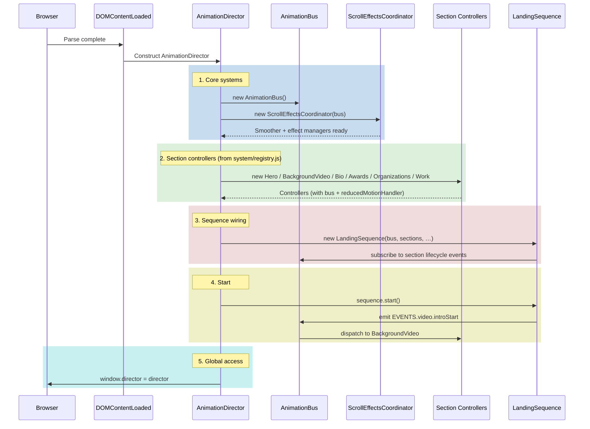

# AnimationDirector Initialization Sequence

How the browser-side choreography system bootstraps after `DOMContentLoaded`.



## Phases

1. **Core systems** — `AnimationDirector` constructs `AnimationBus` (pub/sub) and `ScrollEffectsCoordinator` (scroll smoothing + background/decoration managers).
2. **Section controllers** — instantiated from `system/registry.js`. Each extends [AbstractSection](../js/choreography/system/AbstractSection.js) and receives `{ bus, reducedMotionHandler }`. Active sections: Hero, BackgroundVideo, Bio, Awards, Organizations, Work.
3. **Sequence wiring** — `LandingSequence` subscribes to section lifecycle events (`section:phase:state`) and orchestrates the landing flow.
4. **Start** — sequence emits the first event; sections respond via `AnimationBus`.
5. **Global access** — `window.director` is exposed for debugging.

## DOM contract

The full landing experience expects these IDs to exist. Missing IDs degrade gracefully (the affected section is skipped):

- `#smooth-wrapper`, `#smooth-content` — required for `ScrollSmoother`
- `#hero`, `#overlay-view`, `#bio`, `#awards`, `#organizations`, `#work`

GSAP plugins registered globally: `ScrollTrigger`, `ScrollSmoother`.

## Debug access

```javascript
// Enable verbose event logging on the bus
window.director.enableDebug?.(true);

// Inspect runtime
window.director.getSections?.();
window.director.getSequence?.();
window.director.getStage?.(); // ScrollEffectsCoordinator

// Re-run the landing sequence (for debugging)
window.director.restart?.();
```

## References

- [AnimationDirector.js](../js/choreography/AnimationDirector.js)
- [AnimationBus.js](../js/choreography/system/AnimationBus.js)
- [ScrollEffectsCoordinator.js](../js/choreography/managers/ScrollEffectsCoordinator/ScrollEffectsCoordinator.js)
- [system/registry.js](../js/choreography/system/registry.js)
- [templates/landing/LandingSequence.js](../js/choreography/templates/landing/LandingSequence.js)
- [config/contracts/events.js](../js/choreography/config/contracts/events.js)
