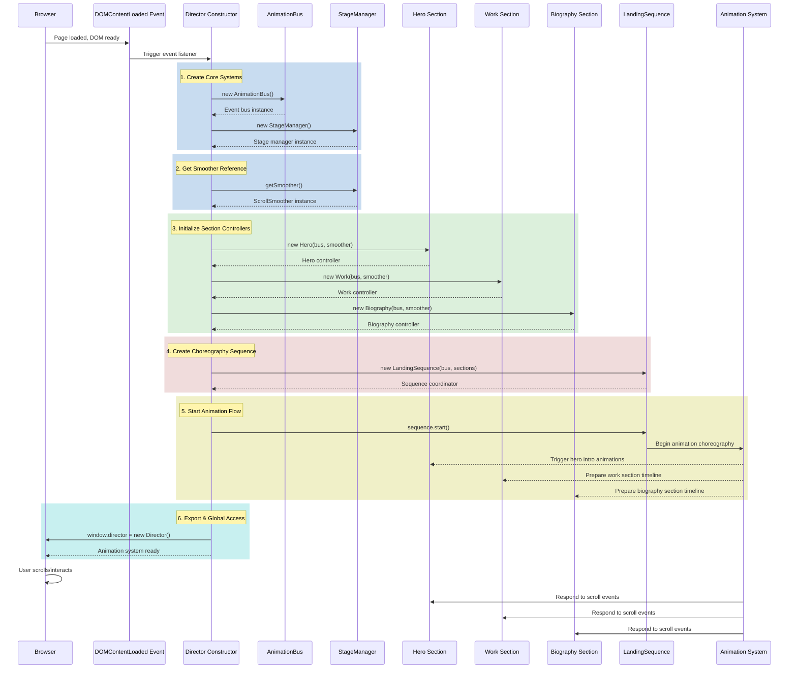

# Director Initialization Sequence Diagram

This diagram illustrates the complete initialization flow of the Director animation system.



## Key Initialization Phases

### Phase 1: Core Systems (Event Bus & Stage)
- **AnimationBus** - Creates centralized event coordination system
- **StageManager** - Initializes scroll smoothing and visual effects

### Phase 2: Section Controllers
- **Hero** - Homepage hero section animations
- **Work** - Portfolio work section animations  
- **Biography** - Biography section animations

Each section controller receives:
- `bus` - AnimationBus instance for event coordination
- `smoother` - ScrollSmoother reference for scroll-based animations

### Phase 3: Choreography Sequence
- **LandingSequence** - Coordinates animation flow between sections
- Sets up event listeners to orchestrate when each animation plays

### Phase 4: Start Animation
- Sequence begins, ready to respond to user interactions
- Animations trigger based on scroll position and events

### Phase 5: Global Access
- Director instance exposed at `window.director`
- Enables debugging and external control

## Timing

- **DOMContentLoaded** - Triggered when DOM is fully parsed (fast initialization)
- **Asset loading** - Gracefully handles assets still loading
- **First paint** - Animations ready before page fully renders

## Critical Requirements

- DOM elements: `#main-header`, `#work`, `#biography`, `#smooth-wrapper`, `#smooth-content`
- Background video: `/assets/video/sizzle.mp4`
- Overlay view molecule in template: `overlay-view.njk`
- GSAP plugins registered: `ScrollTrigger`, `ScrollSmoother`

## Debug Access

```javascript
// Enable animation event logging
window.director.enableDebug(true);

// Access individual systems
const sections = window.director.getSections();
const sequence = window.director.getSequence();
const stage = window.director.getStage();

// Control animations
window.director.restart();
```
