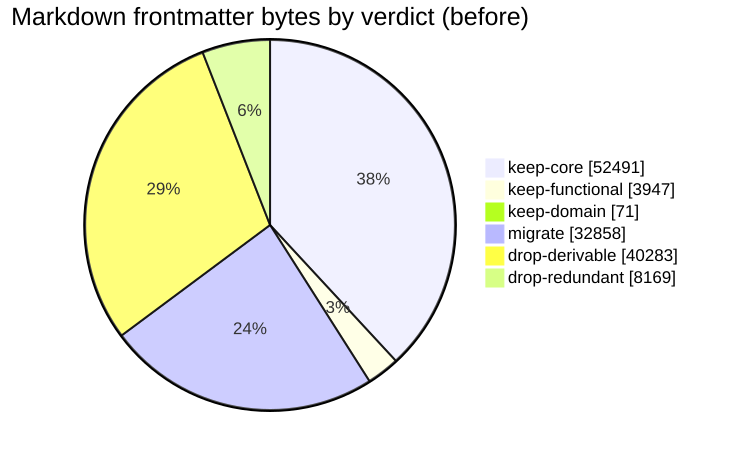
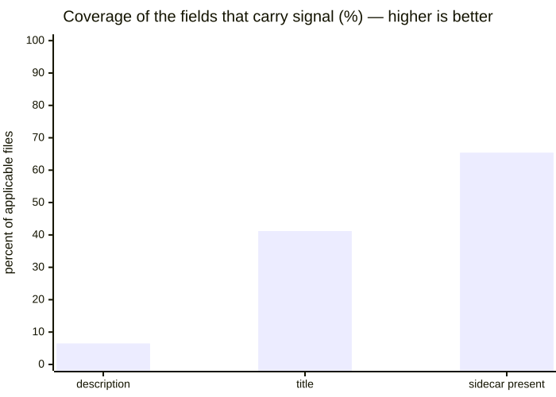
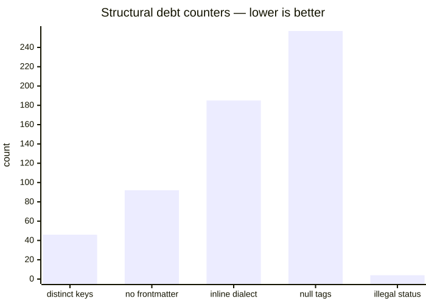
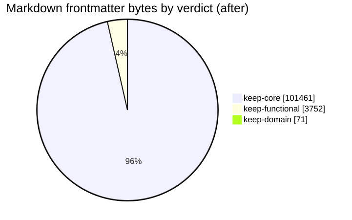
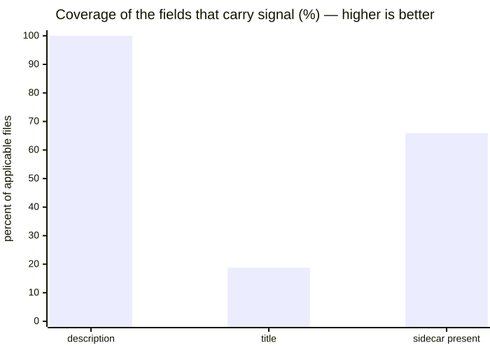
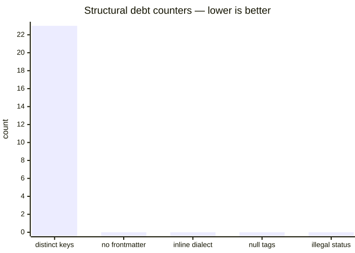

# Frontmatter Audit

Visual evidence for [`plan-frontmatter-strategy.md`](../plan-frontmatter-strategy.md).

Everything here is generated. Do not hand-edit — regenerate instead:

```bash
node scripts/auditFrontmatter.js --label before
node scripts/auditFrontmatter.js --label after --compare before
npm run diagrams:export -- --dir docs/frontmatter-audit
```

The same script produces both snapshots, so `before` and `after` are measured
identically and the delta is trustworthy rather than narrated.

## What each file is

| File                     | Tool      | Shows                                                                     |
| ------------------------ | --------- | ------------------------------------------------------------------------- |
| `snapshot.json`          | any       | Every metric, machine-readable. The source of truth for the diagrams.     |
| `dialects.svg`           | Mermaid   | The competing frontmatter dialects and who reads each.                    |
| `authority.svg`          | Mermaid   | Authority documents vs. measured reality; green once a rule is satisfied. |
| `keys.svg`               | Mermaid   | Every key, grouped by verdict — keep / migrate / drop.                    |
| `verdict.svg`            | Mermaid   | Share of markdown frontmatter bytes by verdict.                           |
| `coverage.svg`           | Mermaid   | Coverage of the fields that carry signal — higher is better.              |
| `debt.svg`               | Mermaid   | Debt counters — every bar should reach zero.                              |
| `keys-cooccurrence.gexf` | **Gephi** | Keys as nodes, co-occurrence as edges. Clusters = schema profiles.        |
| `files-schema.gexf`      | **Gephi** | Bipartite file↔key graph. Clusters = populations sharing a schema shape. |

## Reading the Gephi graphs

`keys-cooccurrence.gexf` is the more useful of the two — it is small enough to
read directly and it answers the question the key list cannot: _which keys travel
together?_ Distinct clusters mean distinct schema profiles, which is the
structural signature of fragmentation.

1. Open in Gephi → **Layout: ForceAtlas 2**, enable _Dissuade Hubs_, run to settle.
2. **Appearance → Nodes → Color → Partition → `verdict`.**
3. **Appearance → Nodes → Size → Ranking → `files`** (min 10, max 60).
4. **Statistics → Modularity**, then re-color by _Modularity Class_ to see the
   profiles the schema actually fell into, independent of the target schema.

Edges are filtered to co-occurrence ≥ 3 and nodes to ≥ 2 files, so the layout
reflects real patterns rather than one-off keys.

`files-schema.gexf` is large (~290 KB, one node per file). Use it to see which
directories share a schema shape — filter by the `area` attribute.

## Delta

Both columns measured by the same script over the same file scope. `before` is
regenerated from a `git worktree` at the pre-change commit, so the two are
directly comparable rather than narrated from memory.

| Measure                                   |               Before |    After |                      |
| ----------------------------------------- | -------------------: | -------: | -------------------- |
| Distinct frontmatter keys                 |                   46 |   **23** | −23                  |
| Files with no frontmatter                 |                   92 |    **0** | −92                  |
| Files carrying the inline JSDoc dialect   |                  185 |    **0** | −185                 |
| `description` coverage                    |                 6.5% | **100%** | +93.5 pts            |
| Frontmatter bytes that are dead weight    |                  59% |   **0%** | −59 pts              |
| Illegal `status` values                   |                    4 |    **0** | −4                   |
| Repo-wide null tags (`frontend`, `js`, …) |                  257 |    **0** | −257                 |
| Removable metadata                        | 137 KB (~35k tokens) | **0 KB** | −137 KB              |
| Sidecar coverage                          |                65.6% |    65.6% | unchanged — deferred |

Sidecar coverage is deliberately untouched: 157 `.js`/`.njk` files still have no
co-located `.md`. That is a separate, larger piece of work — see the plan.

## Before

Measured at commit `882cb79`, prior to any remediation.













## After

Same script, same measurements, after remediation.










