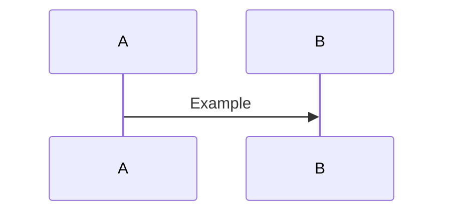

# Storyboards

Author animation storyboards in Markdown with Mermaid.

## Write

Place files under `njk/_pages/storyboards/`:

````markdown
---
layout: templates/storyboards.njk
tags: ['storyboard']
permalink: /storyboards/your-page/
---

# Your Sequence


````

````

## View

- Dev: `npm run dev:11ty` then open `/storyboards/` and your page.
- Build-only: `npm run build:11ty`.

## Export SVG

Generate SVGs from all Mermaid code fences in those Markdown files:

```bash
npm run diagrams:export:storyboards
````

Output is written to `assets/storyboards/*.svg` and served at `/assets/storyboards/*`.

## Tips

- Use Mermaid `sequenceDiagram`, `timeline`, or `graph` for flows.
- Client-side rendering via CDN Mermaid happens in `templates/storyboards.njk`.
- Collection listing uses pages tagged `storyboard`.
