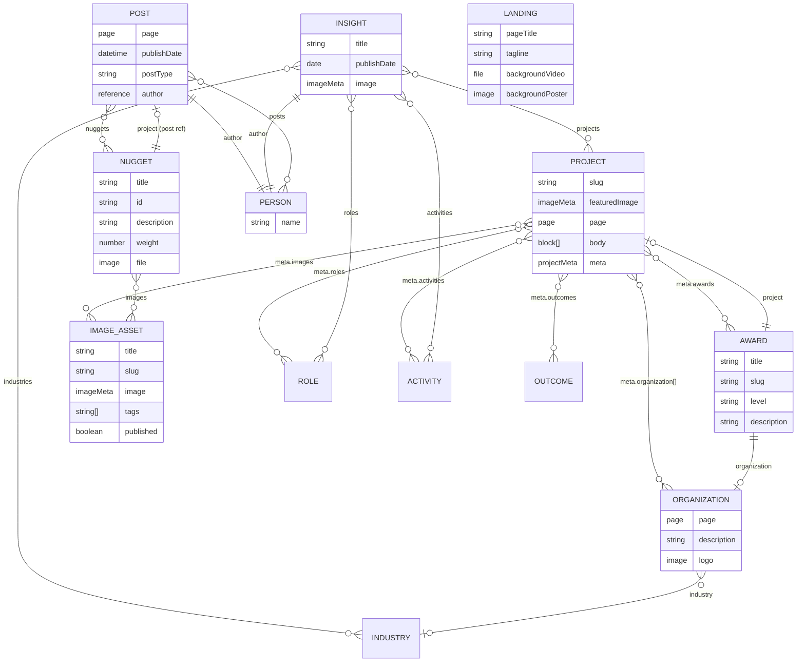
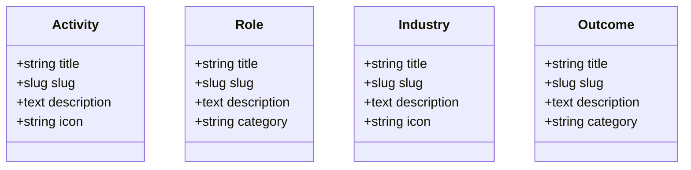
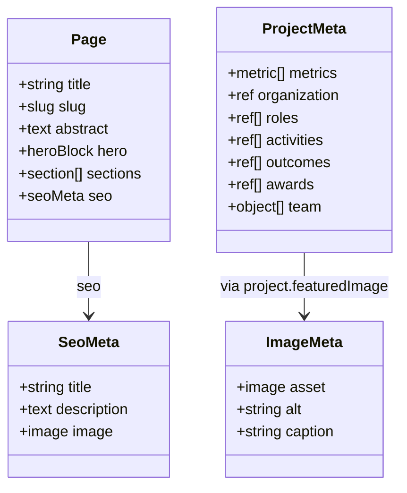

This page documents the Sanity CMS schema types powering the portfolio backend, their field structures, and cross-type relationships.

## Schema Architecture

Types are organized into four layers: **documents** (top-level CMS records), **objects** (embedded sub-schemas), **taxonomies** (reference vocabularies), and **config** (singleton site settings).

---

## Document Relationships

---

## Taxonomy Types

Simple reference documents used for classification and filtering. All taxonomies have `title` and `slug` fields.

---

## Object Types (Embedded)

Objects are not standalone documents — they are embedded within document types.

---

## Config &amp; Site Settings

Singleton documents controlling global site behavior.

| Type           | Purpose                                 |
| -------------- | --------------------------------------- |
| `siteSettings` | Global site title, URL, and default SEO |
| `navigation`   | Primary nav structure                   |
| `uiLabels`     | Editable UI copy and labels             |

---

## Notes

- `project.body` is Portable Text with an optional `project_aside` block for inline commentary.
- `page` is a shared object embedded in `project`, `post`, and `organization` — not a standalone document.
- `nugget` references `post` (not `project`) despite its `project` field name; this is a legacy schema mapping.
- Activity slugs must stay in sync with `PrinterMarks.js` category identifiers for the overlay animation system.
