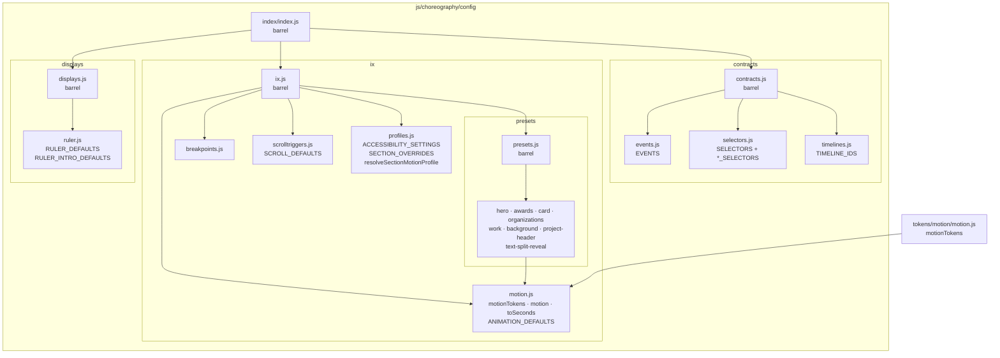

# Choreography Config Package

Shared names, motion tokens and defaults, section motion presets, and decorative
display defaults for the choreography runtime. Nothing here touches the DOM.

## Folders

### `contracts/` — shared vocabulary

Names and IDs used across modules. Treat them as durable contracts.

- `events/events.js` → `EVENTS` (incl. `EVENTS.video.media`), `makeSectionEvents`
- `selectors/selectors.js` → `SELECTORS` (section DOM ids) plus `HERO_SELECTORS`, `AWARD_SELECTORS`, `PROCESS_SELECTORS`, `VIDEO_SELECTORS`, `PROJECT_HEADER_SELECTORS`, `BUILD_INFO_SELECTORS`
- `timelines/timelines.js` → `TIMELINE_IDS`
- `contracts.js` → barrel for the three above

### `ix/` — interaction design tuning

Values expected to change as the design iterates. `ix.js` re-exports the folder.

- `breakpoints.js` → `TAILWIND_BREAKPOINTS`, `BREAKPOINT_MATCH_MEDIA_CONDITIONS`, `getActiveBreakpoint`
- `motion.js` → `motionTokens` (re-exported), `motion` accessor, `toSeconds`, `ANIMATION_DEFAULTS`
- `presets/` → one file per consumer area: `hero.js`, `awards.js`, `card.js`, `organizations.js`, `work.js`, `background.js`, `project-header.js`, `text-split-reveal.js`; `presets.js` is the barrel. See [README.presets.md](ix/presets/README.presets.md).
- `scrolltriggers.js` → `SCROLL_DEFAULTS` only
- `profiles.js` → `ACCESSIBILITY_SETTINGS`, `SECTION_OVERRIDES`, `resolveSectionMotionProfile`

Motion tokens are defined in `js/choreography/tokens/motion/` and re-exported by `motion.js`.

### `displays/` — decorative display defaults

- `ruler/ruler.js` → `RULER_DEFAULTS`, `RULER_INTRO_DEFAULTS`
- `displays.js` → barrel

## Placement rules

| What                                        | Where                                                             |
| ------------------------------------------- | ----------------------------------------------------------------- |
| Names or IDs shared across modules          | `contracts/`                                                      |
| Motion tokens and global defaults           | `ix/motion.js` (tokens themselves live in `tokens/motion/`)       |
| A section's motion preset                   | `ix/presets/<section>.js`                                         |
| A section's ScrollTrigger config            | The organism's `*Triggers.js` — only `SCROLL_DEFAULTS` stays here |
| Breakpoint motion variants                  | `ix/profiles.js` (`SECTION_OVERRIDES`)                            |
| Decorative display defaults                 | `displays/`                                                       |
| Decorative generators (DOM/rendering logic) | `js/displays/`, not config                                        |

Section presets stay in config, not beside their organisms, because molecules
and atoms consume them too. Trigger configs are only read by their organism, so
they live there (`HERO_TRIGGER`, `WORK_TRIGGER`, `AWARDS_TRIGGER`,
`ORGANIZATIONS_TRIGGER`, `BACKGROUND_TRIGGER`, `CARD_*_TRIGGER`).

## Imports

Deep imports to the specific file are the norm — most of the codebase does this:

```js
import { motion } from "../../config/ix/motion.js";
import { HERO_INTRO } from "../../config/ix/presets/hero.js";
import { SCROLL_DEFAULTS } from "../../config/ix/scrolltriggers.js";
```

The `index/index.js` barrel re-exports everything here and is available for convenience:

```js
import { EVENTS, SELECTORS, motion } from "../../config/index/index.js";
```

## Package map


