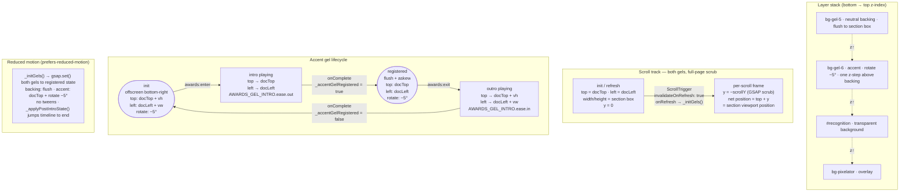

## Motion Strategy

**Key constraints:**
- `top` / `left` / `width` / `height` are layout properties — set only at init and on `ScrollTrigger.refresh()`, never during scrub.
- `y` (transform) is the only property animated per scroll frame.
- Rotation (`−5°`) is state, not motion — set at init and never tweened.
- Intro / outro tweens use `immediateRender: false` so the from-state is captured at play time, after `_initGels()` has positioned the gels.
