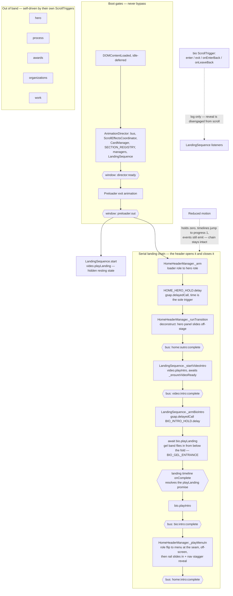

# LandingSequence

Narrative pacing for the homepage. Owns no DOM and no ScrollTrigger — it listens on `AnimationBus` and cues section lifecycle methods in order.

## Motion strategy

### Why it is shaped this way

- **The header opens the landing and closes it.** Its hero exit is the page's first statement; the video reveal answers it; Bio follows a beat later; and the menu rail arrives last, once Bio has had its say. Playing the video intro at `preloader:out` would race the header, so `start()` only stages the video's landing state.
- **The video is cued off `home:outro:complete`, not `home:intro:complete` — and that is load-bearing.** The menu rail's build now waits for `bio:intro:complete` (`HomeHeaderManager._playMenuIn`), so cueing Bio's chain off the rail's *intro* would deadlock: the rail waiting on Bio, Bio waiting on the rail. The hero *exiting* is the earlier, unblocked cue. Anything later added to this chain must respect that cycle.
- **Every link is an event, not a call.** Cross-section coordination goes through `AnimationBus` with `EVENTS` constants — `LandingSequence` never reaches into an organism's internals beyond its public `play*` methods.
- **Reduced motion zeroes holds rather than skipping links.** A gated profile still emits `…:intro:complete` (`AbstractSection` jumps the intro to `progress(1)`), so the chain completes without motion instead of stalling.
- **Timers are `gsap.delayedCall`, never `setTimeout`** — ticker-synced, pausable, killable in `destroy()`.
- **Bio is disengaged from scroll.** Its ScrollTrigger still fires enter/exit for side effects, but the reveal is owned by this chain.
- **The gel entrance gates the bio intro.** `bio.playLanding()` is awaited, not fired-and-forgotten — the heading band has to land before the SplitText reveal starts over it. See [heading-gel.md](../../molecules/bio-motion/heading-gel.md); the promise resolves via `AbstractSection`'s `PromiseResolverQueue`, and resolves immediately under a gated profile so the await can never stall the chain.

### Known drift

None outstanding.

**Resolved 2026-08-20.** A prior note here flagged `BackgroundVideo.playIntro()`'s comment for claiming `LandingSequence` waits on `video:intro:complete` to trigger `hero.playLanding()`. That comment no longer exists — `playIntro()` now carries only a reduced-motion note, and `hero.playLanding` appears nowhere in `organisms/background/` or `templates/landing/`. The chain has always triggered `bio.playIntro()`; the diagram above (`VIC` → `BEAT` → `GEL` → `BIO`) is the accurate account.
