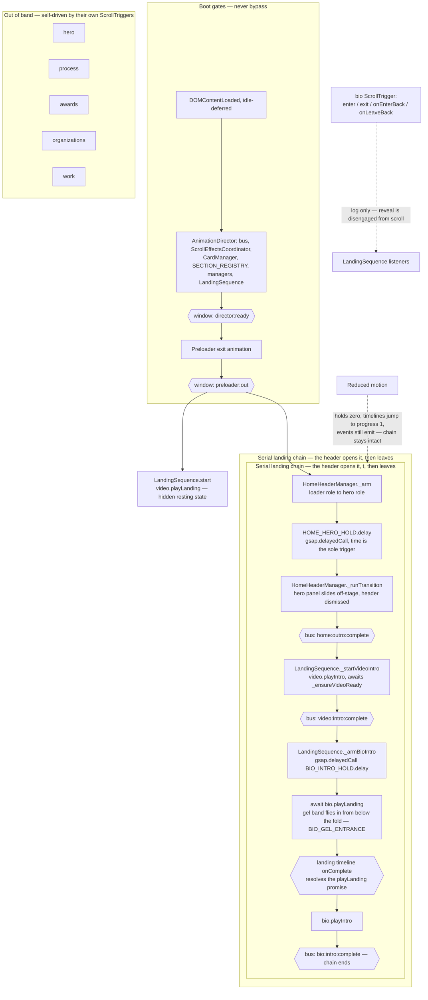

# LandingSequence

Narrative pacing for the homepage. Owns no DOM and no ScrollTrigger — it listens on `AnimationBus` and cues section lifecycle methods in order.

## Methods
- start video intro
- arm bio intro
- pause background video
- resume background video
- register listeners

## Events
- The preloader completes its outro
- The background completes its intro
- The global header completes its intro
- The global footer completes its intro
- The bio section enters the view
- The bio section backs into the view
- The bio section backs out of the view
- The bio section exits the view

## Motion strategy

### Why it is shaped this way

- start() stages the video's landing state.  Playing the video intro at `preloader:out` would race the header, so `start()` ^c4326b
- Await sections.video.playLanding()
- **The video is cued off `home:outro:complete`.** That is the header's only outward cue — it emits no intro events, because after its exit it is dismissed and gone from the page. The chain now terminates at `bio:intro:complete`; nothing consumes that event today, so it is the natural extension point for anything added later.
- **Every link is an event, not a call.** Cross-section coordination goes through `AnimationBus` with `EVENTS` constants — `LandingSequence` never reaches into an organism's internals beyond its public `play*` methods.
- **Reduced motion zeroes holds rather than skipping links.** A gated profile still emits `…:intro:complete` (`AbstractSection` jumps the intro to `progress(1)`), so the chain completes without motion instead of stalling.
- **Timers are `gsap.delayedCall`, never `setTimeout`** — ticker-synced, pausable, killable in `destroy()`.
- **Bio is disengaged from scroll.** Its ScrollTrigger still fires enter/exit for side effects, but the reveal is owned by this chain.
- **The gel entrance gates the bio intro.** `bio.playLanding()` is awaited, not fired-and-forgotten — the heading band has to land before the SplitText reveal starts over it. See [heading-gel.md](../../molecules/bio-motion/heading-gel.md); the promise resolves via `AbstractSection`'s `PromiseResolverQueue`, and resolves immediately under a gated profile so the await can never stall the chain.

### Known drift

None outstanding.
