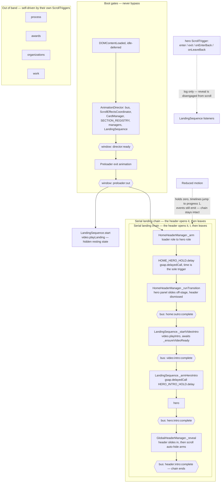

# LandingSequence

Narrative pacing for the homepage. Owns no DOM and no ScrollTrigger — it listens on `AnimationBus` and cues section lifecycle methods in order.

## Methods
- start video intro
- arm hero intro
- pause background video
- resume background video
- register listeners

## Events
- The preloader completes its outro
- The background completes its intro
- The background video completes its intro
- The global footer completes its intro
- The hero section enters the view
- The hero section backs into the view
- The hero section backs out of the view
- The hero section exits the view

## Sequence

Phase 1 is the landing chain: two latches join in `_cueVideoIntro`, then the video intro, the hold, and the hero intro run in series. Phase 2 is Hero's ScrollTrigger gating background-video playback.

```mermaid
sequenceDiagram
  autonumber
  participant W as window
  participant Bus as AnimationBus
  participant LS as LandingSequence
  participant Video as BackgroundVideo (sections.video)
  participant G as gsap.delayedCall
  participant Hero as Hero (sections.hero)

  Note over LS: constructor: listen once for preloader:out on window,<br/>then subscribe to Bus events (_registerListeners)

  rect rgba(120,120,120,0.08)
  Note over W,Hero: Phase 1. Landing chain. Two latches (A and B), arrival order not fixed
  par Latch A: video settles (usually first, before preloader:out)
    Video-)Bus: video:media:playing | error | unavailable<br/>| ready (counts only if reduced motion)
    Bus->>LS: settled handler
    LS->>LS: _videoMediaSettled = true
    LS->>LS: _cueVideoIntro() (returns early until B is set)
  and Latch B: preloader hands off
    W-)LS: preloader:out
    LS->>LS: start(), remove window listener
    LS->>Video: await playLanding() (stage autoAlpha 0)
    Video-->>LS: resolved (errors are logged and swallowed)
    LS->>LS: _videoLandingStaged = true
    LS->>LS: _cueVideoIntro()
  end
  Note over LS: Both latches set and _videoIntroCued is false,<br/>so set _videoIntroCued = true
  LS->>Video: await playIntro() (fade in; play() as safety net)
  Video-)Bus: video:intro:complete
  Bus->>LS: introComplete handler
  LS->>LS: _videoIntroComplete = true
  LS->>G: _armHeroIntro(): delayedCall(hold)<br/>hold = 0 if reduced motion, else HERO_INTRO_HOLD.delay
  G-->>LS: hold elapsed, _heroHoldCall = null
  LS->>Hero: playIntro()
  Note over Hero: Chain ends at hero:intro:complete
  end

  rect rgba(120,120,120,0.08)
  Note over W,Hero: Phase 2. Hero ScrollTrigger controls video play/pause
  Hero-)Bus: hero:enter (also fires at load)
  Bus->>LS: _heroLeftBackwards = false
  LS->>LS: _resumeBackgroundVideo()
  alt reduced motion OR video intro not yet complete
    LS-->>LS: no-op (landing chain still owns playback)
  else
    LS->>Video: videoEl.play() (rejection ignored)
  end

  Hero-)Bus: hero:onEnterBack
  Bus->>LS: _heroLeftBackwards = false
  LS->>Video: _resumeBackgroundVideo() (same gate)

  alt Scroll down past Hero
    Hero-)Bus: hero:exit
    Bus->>LS: _heroLeftBackwards is false
    LS->>Video: videoEl.pause() (holds last frame for gel blend)
  else Scroll up above Hero's start
    Hero-)Bus: hero:onLeaveBack
    Bus->>LS: _heroLeftBackwards = true
    LS->>Video: _resumeBackgroundVideo() (same gate)
    Hero-)Bus: hero:exit (sent right after; dispatch is synchronous)
    Bus->>LS: _heroLeftBackwards is true, so clear it and return (no pause)
  end
  end

  Note over LS: destroy(): kill _heroHoldCall, reset all flags,<br/>unsubscribe Bus listeners, clear references
```

## Motion strategy

```mermaid
---
id: 203d9974-a23a-483a-8c76-d8d3354cd124
---
flowchart TD
    subgraph boot["Boot gates — never bypass"]
        DCL["DOMContentLoaded, idle-deferred"] --> AD["AnimationDirector: bus, ScrollEffectsCoordinator,<br/>CardManager, SECTION_REGISTRY, managers, LandingSequence"]
        AD --> DR{{"window: director:ready"}}
        DR --> PRE["Preloader exit animation"]
        PRE --> PO{{"window: preloader:out"}}
    end

    PO --> LS["LandingSequence.start<br/>video.playLanding — hidden resting state"]
    PO --> ARM["HomeHeaderManager._arm<br/>loader role to hero role"]

    subgraph chain["Serial landing chain — the header opens it, then leaves"]
        subgraph chain_inner["Serial landing chain — the header opens it, t, then leaves"]
            direction TB
            ARM --> HOLD["HOME_HERO_HOLD.delay<br/>gsap.delayedCall, time is the sole trigger"]
            HOLD --> DECON["HomeHeaderManager._runTransition<br/>hero panel slides off-stage, header dismissed"]
            DECON --> HOC{{"bus: home:outro:complete"}}
            HOC --> VID["LandingSequence._startVideoIntro<br/>video.playIntro, awaits _ensureVideoReady"]
            VID --> VIC{{"bus: video:intro:complete"}}
            VIC --> BEAT["LandingSequence._armHeroIntro<br/>gsap.delayedCall HERO_INTRO_HOLD.delay"]
            BEAT --> HERO["hero.playIntro<br/>gel band already at rest, full-bleed — no entrance"]
            HERO --> BIC{{"bus: hero:intro:complete"}}
            BIC --> HDR["GlobalHeaderManager._reveal<br/>header slides in, then scroll auto-hide arms"]
            HDR --> HIC{{"bus: header:intro:complete — chain ends"}}
        end
    end

    subgraph scroll["Out of band — self-driven by their own ScrollTriggers"]
        direction LR
        HERO["hero"]
        PROC["process"]
        AWARDS["awards"]
        ORGS["organizations"]
        WORK["work"]
    end

    HEROST["hero ScrollTrigger:<br/>enter / exit / onEnterBack / onLeaveBack"] -.->|"log only — reveal is disengaged from scroll"| LSOBS["LandingSequence listeners"]

    RM["Reduced motion"] -.->|"holds zero, timelines jump to progress 1,<br/>events still emit — chain stays intact"| chain_inner
```

### Why it is shaped this way

- start() stages the video's landing state.  Playing the video intro at `preloader:out` would race the header, so `start()` ^c4326b
- Await sections.video.playLanding()
- **The video is cued off `home:outro:complete`.** That is the header's only outward cue — it emits no intro events, because after its exit it is dismissed and gone from the page. LandingSequence's own chain terminates at `hero:intro:complete`. GlobalHeaderManager listens for it and reveals the header as the final beat, emitting `header:intro:complete`.
- **Every link is an event, not a call.** Cross-section coordination goes through `AnimationBus` with `EVENTS` constants — `LandingSequence` never reaches into an organism's internals beyond its public `play*` methods.
- **Reduced motion zeroes holds rather than skipping links.** A gated profile still emits `…:intro:complete` (`AbstractSection` jumps the intro to `progress(1)`), so the chain completes without motion instead of stalling.
- **Timers are `gsap.delayedCall`, never `setTimeout`** — ticker-synced, pausable, killable in `destroy()`.
- **Hero is disengaged from scroll.** Its ScrollTrigger still fires enter/exit for side effects, but the reveal is owned by this chain.
- **The gel has no entrance.** The heading band is parked full-bleed at rest when hero's timelines build, so the chain goes straight from the hold to `hero.playIntro()` — no `playLanding()` await. See [heading-gel.md](../../molecules/hero-motion/heading-gel.md).

### Known drift

None outstanding.
