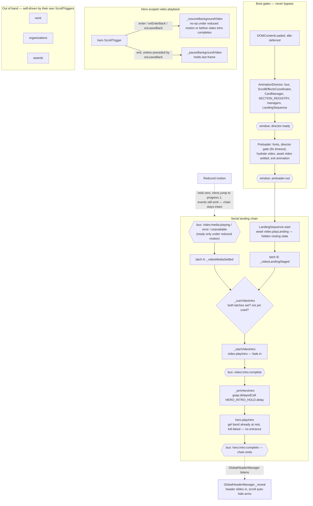

# LandingSequence

Narrative pacing for the homepage. Owns no DOM and no ScrollTrigger — it listens on `AnimationBus` and cues section lifecycle methods in order.

## Methods

- `start()` — stage the video's landing state, then latch it
- `_cueVideoIntro()` — join the two latches; run the video intro once
- `_startVideoIntro()` — fade the background video in
- `_armHeroIntro()` — hold a beat, then play Hero's intro
- `_pauseBackgroundVideo()` / `_resumeBackgroundVideo()` — Hero-scoped playback gate
- `_registerListeners()` — subscribe to the bus events below
- `reset()` / `destroy()`

## Events

- `preloader:out` (window) — the preloader completes its outro
- `video:media:playing` | `error` | `unavailable` — the background video settles; `video:media:ready` counts only under reduced motion
- `video:intro:complete` — the background video completes its intro
- `hero:enter` — the hero section enters the view
- `hero:onEnterBack` — the hero section backs into the view
- `hero:onLeaveBack` — the hero section backs out of the view
- `hero:exit` — the hero section exits the view (either direction)

## Sequence

Phase 1 is the landing chain: two latches join in `_cueVideoIntro`, then the video intro, the hold, and the hero intro run in series. Phase 2 is Hero's ScrollTrigger gating background-video playback.

```mermaid
sequenceDiagram
  autonumber
  participant W as window
  participant Bus as AnimationBus
  participant LS as LandingSequence
  participant Video as BackgroundVideo (sections.video)
  participant G as gsap.delayedCall
  participant Hero as Hero (sections.hero)

  Note over LS: constructor: listen once for preloader:out on window,<br/>then subscribe to Bus events (_registerListeners)

  rect rgba(120,120,120,0.08)
  Note over W,Hero: Phase 1. Landing chain. Two latches (A and B), arrival order not fixed
  par Latch A: video settles (usually first, before preloader:out)
    Video-)Bus: video:media:playing | error | unavailable<br/>| ready (counts only if reduced motion)
    Bus->>LS: settled handler
    LS->>LS: _videoMediaSettled = true
    LS->>LS: _cueVideoIntro() (returns early until B is set)
  and Latch B: preloader hands off
    W-)LS: preloader:out
    LS->>LS: start(), remove window listener
    LS->>Video: await playLanding() (stage autoAlpha 0)
    Video-->>LS: resolved (errors are logged and swallowed)
    LS->>LS: _videoLandingStaged = true
    LS->>LS: _cueVideoIntro()
  end
  Note over LS: Both latches set and _videoIntroCued is false,<br/>so set _videoIntroCued = true
  LS->>Video: await playIntro() (fade in; play() as safety net)
  Video-)Bus: video:intro:complete
  Bus->>LS: introComplete handler
  LS->>LS: _videoIntroComplete = true
  LS->>G: _armHeroIntro(): delayedCall(hold)<br/>hold = 0 if reduced motion, else HERO_INTRO_HOLD.delay
  G-->>LS: hold elapsed, _heroHoldCall = null
  LS->>Hero: playIntro()
  Note over Hero: Chain ends at hero:intro:complete
  end

  rect rgba(120,120,120,0.08)
  Note over W,Hero: Phase 2. Hero ScrollTrigger controls video play/pause
  Hero-)Bus: hero:enter (also fires at load)
  Bus->>LS: _heroLeftBackwards = false
  LS->>LS: _resumeBackgroundVideo()
  alt reduced motion OR video intro not yet complete
    LS-->>LS: no-op (landing chain still owns playback)
  else
    LS->>Video: videoEl.play() (rejection ignored)
  end

  Hero-)Bus: hero:onEnterBack
  Bus->>LS: _heroLeftBackwards = false
  LS->>Video: _resumeBackgroundVideo() (same gate)

  alt Scroll down past Hero
    Hero-)Bus: hero:exit
    Bus->>LS: _heroLeftBackwards is false
    LS->>Video: videoEl.pause() (holds last frame for gel blend)
  else Scroll up above Hero's start
    Hero-)Bus: hero:onLeaveBack
    Bus->>LS: _heroLeftBackwards = true
    LS->>Video: _resumeBackgroundVideo() (same gate)
    Hero-)Bus: hero:exit (sent right after; dispatch is synchronous)
    Bus->>LS: _heroLeftBackwards is true, so clear it and return (no pause)
  end
  end

  Note over LS: destroy(): kill _heroHoldCall, reset all flags,<br/>unsubscribe Bus listeners, clear references
```

## Motion strategy

```mermaid
---
id: 203d9974-a23a-483a-8c76-d8d3354cd124
---
flowchart TD
    subgraph boot["Boot gates — never bypass"]
        DCL["DOMContentLoaded, idle-deferred"] --> AD["AnimationDirector: bus, ScrollEffectsCoordinator,<br/>CardManager, SECTION_REGISTRY, managers, LandingSequence"]
        AD --> DR{{"window: director:ready"}}
        DR --> PRE["Preloader: fonts, director gate (8s timeout),<br/>hydrate video, await video settled, exit animation"]
        PRE --> PO{{"window: preloader:out"}}
    end

    subgraph chain["Serial landing chain"]
        direction TB
        VS{{"bus: video:media:playing / error / unavailable<br/>(ready only under reduced motion)"}} --> LA["latch A: _videoMediaSettled"]
        PO --> START["LandingSequence.start<br/>await video.playLanding — hidden resting state"]
        START --> LB["latch B: _videoLandingStaged"]
        LA --> CUE{"_cueVideoIntro<br/>both latches set? not yet cued?"}
        LB --> CUE
        CUE --> VID["_startVideoIntro<br/>video.playIntro — fade in"]
        VID --> VIC{{"bus: video:intro:complete"}}
        VIC --> BEAT["_armHeroIntro<br/>gsap.delayedCall HERO_INTRO_HOLD.delay"]
        BEAT --> HERO["hero.playIntro<br/>gel band already at rest, full-bleed — no entrance"]
        HERO --> BIC{{"bus: hero:intro:complete — chain ends"}}
    end

    BIC -.->|"GlobalHeaderManager listens"| HDR["GlobalHeaderManager._reveal<br/>header slides in, scroll auto-hide arms"]

    subgraph gate["Hero-scoped video playback"]
        direction LR
        HEROST["hero ScrollTrigger"] -->|"enter / onEnterBack / onLeaveBack"| RES["_resumeBackgroundVideo<br/>no-op under reduced motion or before video intro completes"]
        HEROST -->|"exit, unless preceded by onLeaveBack"| PAU["_pauseBackgroundVideo<br/>holds last frame"]
    end

    subgraph scroll["Out of band — self-driven by their own ScrollTriggers"]
        direction LR
        WORK["work"]
        ORGS["organizations"]
        AWARDS["awards"]
    end

    RM["Reduced motion"] -.->|"hold zero, intros jump to progress 1,<br/>events still emit — chain stays intact"| chain
```

### Why it is shaped this way

- **The reveal is cued off the video's own media events.** It used to be `home:outro:complete` from HomeHeaderManager. AnimationDirector no longer constructs that manager, so nothing emitted the cue and the video sat at autoAlpha 0. The `video:media:*` events always arrive (BackgroundVideo emits exactly one per path, with a 4 s failsafe), and `playing` means frames are moving, so the fade never reveals a still poster.
- **Two latches, one join.** The video usually settles _before_ `preloader:out` — the preloader holds its splash until the video reports. A timed-out director gate or a late video error can invert that. `_cueVideoIntro` waits for both the settled event and `playLanding()`, whichever comes last, and `_videoIntroCued` makes it run once.
- **`playLanding()` is awaited before latch B is set.** Revealing while `playLanding()` is still tweening toward autoAlpha 0 would be undone by it.
- **The chain ends at `hero:intro:complete`.** GlobalHeaderManager listens for it on home and reveals the header as the final beat. Pages without a hero reveal the header immediately.
- **Every link is an event, not a call.** Cross-section coordination goes through `AnimationBus` with `EVENTS` constants — `LandingSequence` never reaches into an organism's internals beyond its public `play*` methods and `video.videoEl`.
- **Reduced motion zeroes holds rather than skipping links.** A gated profile still emits `…:intro:complete` (`AbstractSection` jumps the intro to `progress(1)`), so the chain completes without motion instead of stalling.
- **Timers are `gsap.delayedCall`, never `setTimeout`** — ticker-synced, pausable, killable in `destroy()`.
- **Hero's reveal is disengaged from scroll; its ScrollTrigger gates video playback.** The video plays while Hero is on screen and pauses once you scroll past it. Only play/pause changes — the gels in `#sizzle-background` blend against the video's painted frame, so a paused video holds the composite unchanged.
- **`exit` is not directional.** `AbstractSection._onLeaveBack` emits `onLeaveBack` and then `exit`. The `onLeaveBack` listener sets `_heroLeftBackwards` so the `exit` that follows skips the pause; scrolling up above Hero is the landing, where the video should keep playing.
- **No scroll-driven resume before the video intro completes.** Hero's ScrollTrigger fires `enter` at load; resuming on it would start the video underneath its own reveal.
- **The gel has no entrance.** The heading band is parked full-bleed at rest when hero's timelines build, so the chain goes straight from the hold to `hero.playIntro()`. See [heading-gel.md](../../molecules/hero-motion/heading-gel.md).

### Known drift

- The constructor comment `DISABLED INITIAL PRELOADER LISTENER FOR STYLING WORK ON PRELOADER VIEW` in `LandingSequence.js` is stale — the `preloader:out` listener is active.
