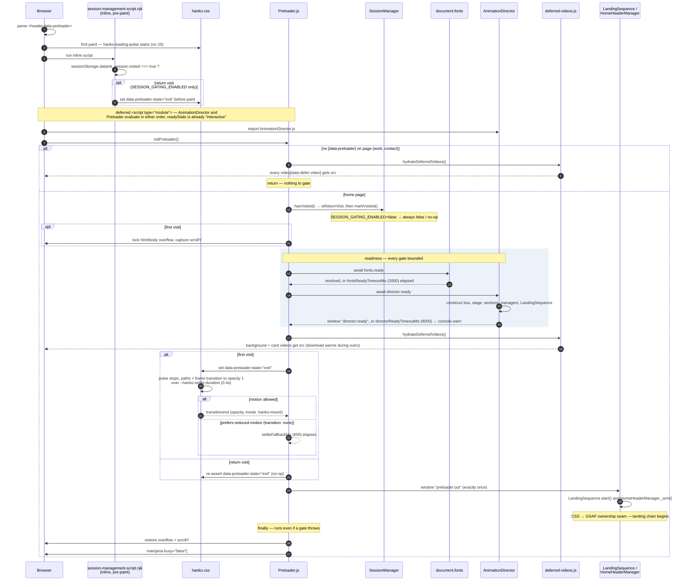
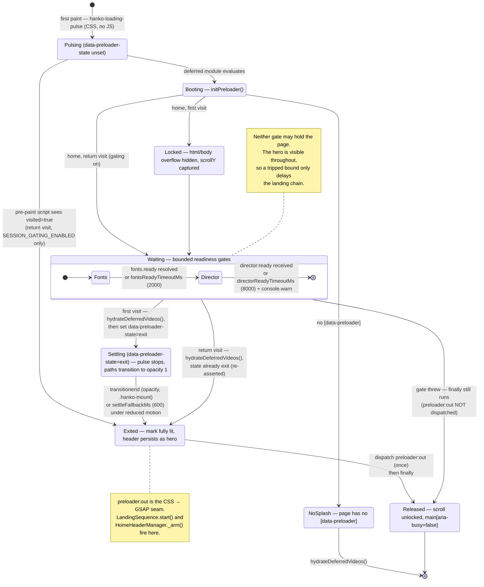

# Preloader package

Three files. The visuals are not here — they are pure CSS in
[hanko.css](../../styles/components/hanko.css). This package decides *when*.

## Sequence

## States

The same flow as a state machine. The state the CSS reads is
`data-preloader-state` (unset → `exit`); everything else is JS-internal.

## Contracts

**Markup** — [home-landing.njk](../../views/organisms/header/home/home-landing.njk).
The landing `<header>` carries `data-preloader`; it *is* the preloader and is
never removed. Its `.hanko-mount` is the element whose settle transition ends
the outro. [session-management-script.njk](../../views/templates/partials/session-management-script.njk)
runs inline right after it and sets the exit state before first paint on return
visits, reading the same `sessionStorage` key as `SessionManager`.

**CSS** — `[data-preloader][data-preloader-state="exit"]` in `hanko.css` stops
the pulse and transitions the paths to full opacity over
`--hanko-settle-duration`. `constants.js` `settleFallbackMs` must exceed it.
Under `prefers-reduced-motion` the global utility forces `transition: none`, so
the fallback is the only path that fires.

**Events** — `director:ready` in, `preloader:out` out, both on `window`, names
from `js/choreography/config/contracts/events/events.js`. `preloader:out` is
the seam where motion ownership passes from CSS to GSAP; it fires exactly once.

## Session gating

`SESSION_GATING_ENABLED` in `SessionManager.js` (currently `false`) switches
the return-visit path for the whole landing sequence — the preloader's `visited`
check and every section's `played` check. While off, `hasVisited()` is always
`false`, so the splash and outro run on every load and the pre-paint script
never fires.

## Bounds

Every wait is bounded (`constants.js`). The hero is visible throughout the
splash, so the cost of a tripped bound is a late landing chain, never a stuck
page. The director timeout is the only one that warns to the console.

## Deferred video

`deferred-videos.js` is the single owner of `data-defer-video`. Nothing else
assigns `src` to those elements.
