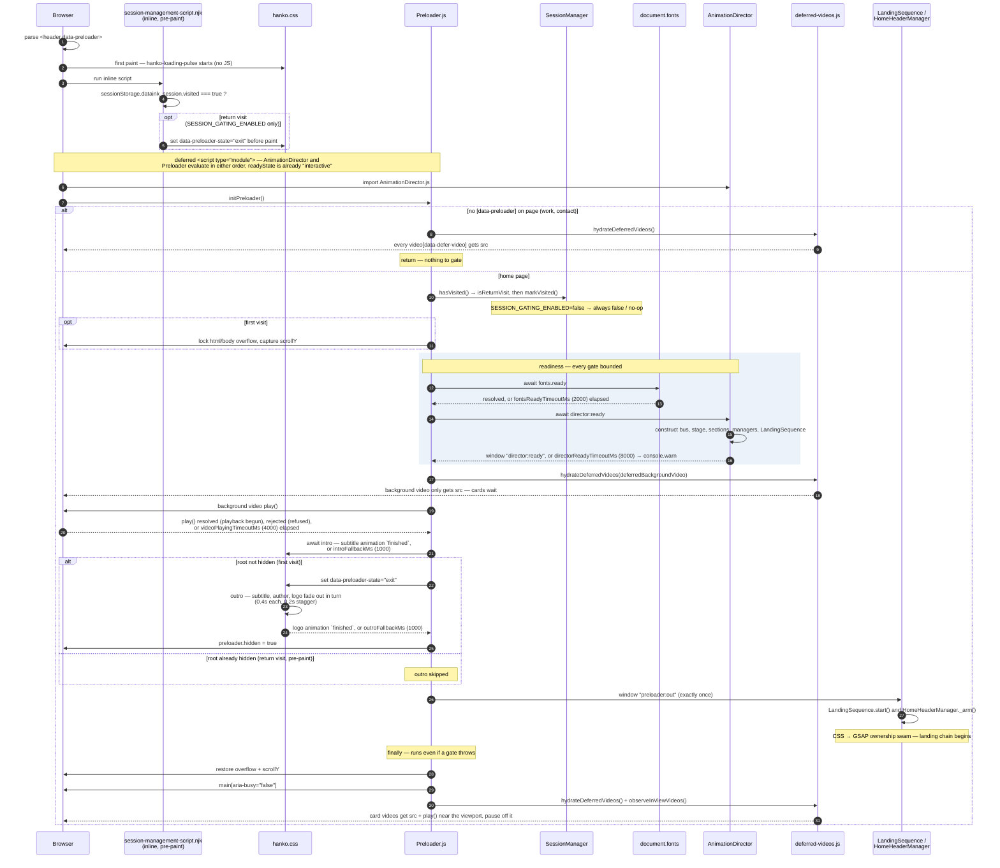
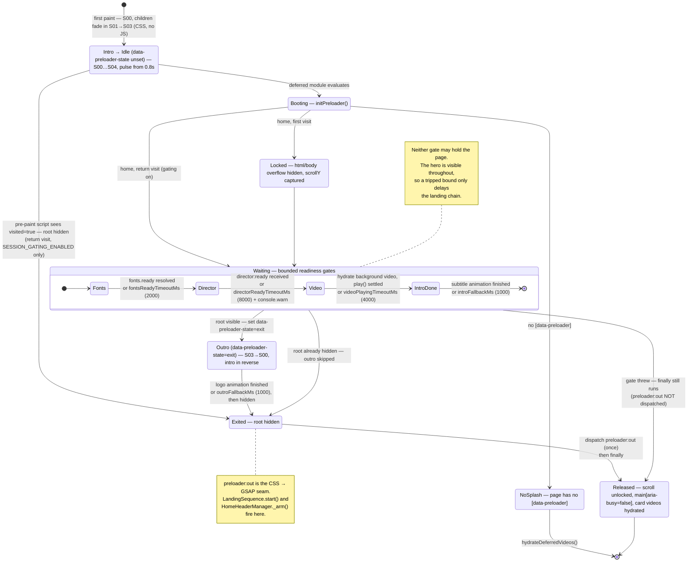

# Preloader package

Three files. The visuals are not here — they are pure CSS in
[hanko.css](../../styles/components/hanko.css). This package decides *when*.

## Sequence

## States

The same flow as a state machine. The state the CSS reads is
`data-preloader-state` (unset → `exit`); everything else is JS-internal.

## Contracts

**Markup** — [preloader.njk](../../views/organisms/status/preloader.njk).
A `
` holding `[data-preloader-logo]`,
`[data-preloader-author]`, `[data-preloader-subtitle]`. The subtitle is the
last child in (intro gate) and the logo the last child out (outro gate); the
root gets `hidden` once the outro lands.
[session-management-script.njk](../../views/templates/partials/session-management-script/session-management-script.njk)
runs inline in `<head>` and sets `hidden` before first paint on return visits,
reading the same `sessionStorage` key as `SessionManager`.

**CSS** — `hanko.css` owns every state (S00–S04, see
[preloader.md](../../views/organisms/status/preloader.md)). Intro and idle are
keyframes that start at first paint with no attribute; `data-preloader-state="exit"`
runs the outro. `constants.js` `introFallbackMs` / `outroFallbackMs` must exceed
each sequence's total (`--preloader-step-duration` + 2 × `--preloader-step-stagger`).
Under `prefers-reduced-motion` the global utility forces `animation: none`; the
stylesheet snaps the states and the JS gates resolve at once (no animations to
await).

**Video** — the home sizzle (`#background video`) must be playing before the
outro. `Preloader.js` calls `play()` itself after hydration and awaits the
promise; `BackgroundVideo.playIntro()` later finds it already playing.

**Events** — `director:ready` in, `preloader:out` out, both on `window`, names
from `js/choreography/config/contracts/events/events.js`. `preloader:out` is
the seam where motion ownership passes from CSS to GSAP; it fires exactly once.

## Session gating

`SESSION_GATING_ENABLED` in `SessionManager.js` (currently `false`) switches
the return-visit path for the whole landing sequence — the preloader's `visited`
check and every section's `played` check. While off, `hasVisited()` is always
`false`, so the splash and outro run on every load and the pre-paint script
never fires.

## Bounds

Every wait is bounded (`constants.js`). The hero is visible throughout the
splash, so the cost of a tripped bound is a late landing chain, never a stuck
page. The director timeout is the only one that warns to the console.

## Deferred video

`deferred-videos.js` is the single owner of `data-defer-video`. Nothing else
assigns `src` to those elements. On the home page it runs twice: the
background video alone at readiness (it is what the playback gate waits on),
then everything left in `finally`, after `preloader:out`. Card videos are
play-in-view (`data-play-in-view`, no `autoplay`): `observeInViewVideos()`
assigns their `src` and calls `play()` only when they come within
`PRELOADER_IN_VIEW.rootMargin` of the viewport, and pauses them when they
leave. `autoplay` is deliberately absent — it overrides `preload="none"` and
would fetch every card video as soon as it had a `src`. While the splash is
up, the only media on the wire is the one video the gate is waiting for.
