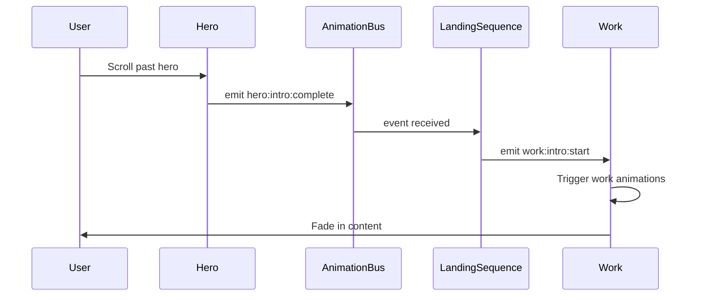
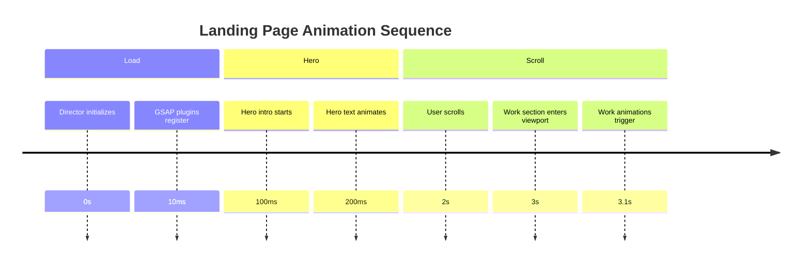
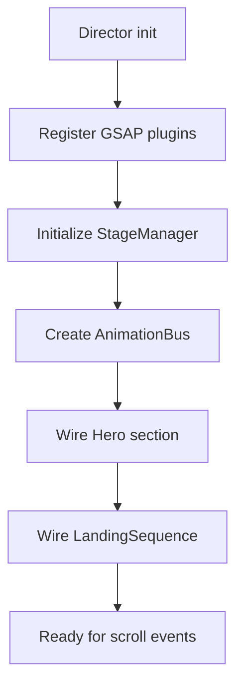

Documenting the landing sequence: Hero → LandingSequence → Work.

### Sequence: Hero → Work

```mermaid
sequenceDiagram
    participant User
    participant Hero
    participant AnimationBus
    participant LandingSequence
    participant Work

    User->>Hero: Scroll past hero
    Hero->>AnimationBus: emit hero:intro:complete
    AnimationBus->>LandingSequence: event received
    LandingSequence->>Work: emit work:intro:start
    Work->>Work: Trigger work animations
    Work->>User: Fade in content
```

### Timeline

```mermaid
timeline
    title Landing Page Animation Sequence
    section Load
    Director initializes : 0s
    GSAP plugins register : 10ms
    section Hero
    Hero intro starts : 100ms
    Hero text animates : 200ms
    section Scroll
    User scrolls : 2s
    Work section enters viewport : 3s
    Work animations trigger : 3.1s
```

### System Graph

```mermaid
graph TD
    A[Director init] --> B[Register GSAP plugins]
    B --> C[Initialize StageManager]
    C --> D[Create AnimationBus]
    D --> E[Wire Hero section]
    E --> F[Wire LandingSequence]
    F --> G[Ready for scroll events]
```
